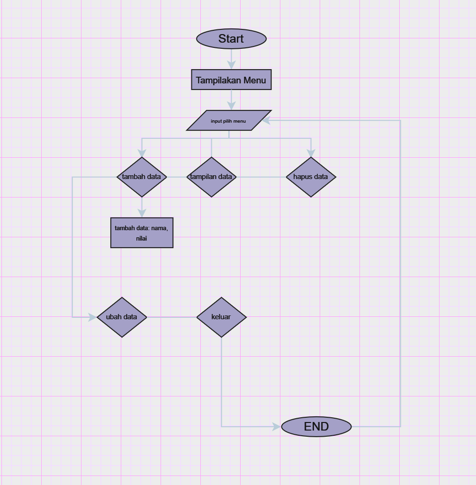

## Program Menampilkan Daftar Nilai Mahasiswa
## Deskripsi program
Program sederhana ini dibuat menggunakan bahasa python Dictionary dengan fitur:

Pengguna untuk mengelola data mahasiswa, termasuk menambah, mengubah, menghapus, dan menampilkan nilai mahasiswa
## Flowchart Program


# Kode Program
``` python
# Daftar nilai mahasiswa
mahasiswa = {}

# Fungsi untuk menambah data
def tambah(nama, nilai):
    mahasiswa[nama] = nilai
    print(f"Data mahasiswa {nama} dengan nilai {nilai} telah ditambahkan.")

# Fungsi untuk menampilkan data
def tampilkan():
    if mahasiswa:
        print("Daftar Mahasiswa dan Nilai:")
        for nama, nilai in mahasiswa.items():
            print(f"Nama: {nama}, Nilai: {nilai}")
    else:
        print("Tidak ada data mahasiswa.")

# Fungsi untuk menghapus data berdasarkan nama
def hapus(nama):
    if nama in mahasiswa:
        del mahasiswa[nama]
        print(f"Data mahasiswa {nama} telah dihapus.")
    else:
        print(f"Mahasiswa dengan nama {nama} tidak ditemukan.")

# Fungsi untuk mengubah data berdasarkan nama
def ubah(nama, nilai_baru):
    if nama in mahasiswa:
        mahasiswa[nama] = nilai_baru
        print(f"Data mahasiswa {nama} telah diubah menjadi nilai {nilai_baru}.")
    else:
          print(f"Mahasiswa dengan nama {nama} tidak ditemukan.")

# Menu untuk interaksi dengan pengguna
def menu():
    while True:
        print("\nMenu:")
        print("1. Tambah Data")
        print("2. Tampilkan Data")
        print("3. Hapus Data")
        print("4. Ubah Data")
        print("5. Keluar")
        pilihan = input("Pilih menu (1/2/3/4/5): ")

        if pilihan == '1':
            nama = input("Masukkan nama mahasiswa: ")
            nilai = input("Masukkan nilai mahasiswa: ")
            tambah(nama, nilai)
        elif pilihan == '2':
            tampilkan()
        elif pilihan == '3':
            nama = input("Masukkan nama mahasiswa yang ingin dihapus: ")
            hapus(nama)
        elif pilihan == '4':
            nama = input("Masukkan nama mahasiswa yang ingin diubah: ")
            nilai_baru = input("Masukkan nilai baru: ")
            ubah(nama, nilai_baru)
        elif pilihan == '5':
            print("Keluar dari program.")
            break
        else:
            print("Pilihan tidak valid. Silakan coba lagi.")

# Menjalankan program
menu()
```
## Ouput Program
````
PS C:\Users\user\Documents\Kuliah> & C:/Users/user/AppData/Local/Programs/Python/Python312/python.exe c:/Users/user/Documents/Kuliah/lab2py/lab7.py

Menu:
1. Tambah Data
2. Tampilkan Data
3. Hapus Data
4. Ubah Data
5. Keluar
Pilih menu (1/2/3/4/5): 1
Masukkan nama mahasiswa: doyoung
Masukkan nilai mahasiswa: 97
Data mahasiswa doyoung dengan nilai 97 telah ditambahkan.

Menu:
1. Tambah Data
2. Tampilkan Data
3. Hapus Data
4. Ubah Data
5. Keluar
Pilih menu (1/2/3/4/5): 1
Masukkan nama mahasiswa: jihoon
Masukkan nilai mahasiswa: 98
Data mahasiswa jihoon dengan nilai 98 telah ditambahkan.

Menu:
1. Tambah Data
2. Tampilkan Data
3. Hapus Data
4. Ubah Data
5. Keluar
Pilih menu (1/2/3/4/5): 1
Masukkan nama mahasiswa: jeo
Masukkan nilai mahasiswa: 100
Data mahasiswa jeo dengan nilai 100 telah ditambahkan.

Menu:
1. Tambah Data
2. Tampilkan Data
3. Hapus Data
4. Ubah Data
5. Keluar
Pilih menu (1/2/3/4/5): 1
Masukkan nama mahasiswa: sahi
Masukkan nilai mahasiswa: 97
Data mahasiswa sahi dengan nilai 97 telah ditambahkan.

Menu:
1. Tambah Data
2. Tampilkan Data
3. Hapus Data
4. Ubah Data
5. Keluar
Pilih menu (1/2/3/4/5): 1
Masukkan nama mahasiswa: yoshi
Masukkan nilai mahasiswa: 99
Data mahasiswa yoshi dengan nilai 99 telah ditambahkan.

Menu:
1. Tambah Data
2. Tampilkan Data
3. Hapus Data
4. Ubah Data
5. Keluar
Pilih menu (1/2/3/4/5): 2
Daftar Mahasiswa dan Nilai:
Nama: doyoung, Nilai: 97
Nama: jihoon, Nilai: 98
Nama: jeo, Nilai: 100
Nama: sahi, Nilai: 97
Nama: yoshi, Nilai: 99

Menu:
1. Tambah Data
2. Tampilkan Data
3. Hapus Data
1. Tambah Data
2. Tampilkan Data
3. Hapus Data
4. Ubah Data
5. Keluar
Pilih menu (1/2/3/4/5): 2
Daftar Mahasiswa dan Nilai:
Nama: doyoung, Nilai: 97
Nama: jihoon, Nilai: 98
Nama: jeo, Nilai: 100
Nama: sahi, Nilai: 97
Nama: yoshi, Nilai: 99

Menu:
1. Tambah Data
2. Tampilkan Data
3. Hapus Data
Nama: jeo, Nilai: 100
Nama: sahi, Nilai: 97
Nama: yoshi, Nilai: 99

Menu:
1. Tambah Data
2. Tampilkan Data
3. Hapus Data
Menu:
1. Tambah Data
2. Tampilkan Data
3. Hapus Data
1. Tambah Data
2. Tampilkan Data
3. Hapus Data
4. Ubah Data
5. Keluar
Pilih menu (1/2/3/4/5): 5
4. Ubah Data
5. Keluar
Pilih menu (1/2/3/4/5): 5
Keluar dari program.
PS C:\Users\user\Documents\Kuliah>
````

## Cara Kerja Program

1. Pendahuluan

   - Program ini berfungsi sebagai sistem manajemen data nilai mahasiswa.

2. Struktur Data yang Digunakan

   - Dictionary (mahasiswa) digunakan untuk menyimpan data.
   - *Key*: Nama mahasiswa (string)
   - *Value*: Nilai mahasiswa (string atau angka, tergantung input pengguna)

3. Langkah Kerja Program

   a. Menampilkan Menu
      - Program menampilkan menu pilihan yang berisi:
         1. Tambah Data
         2. Tampilkan Data
         3. Hapus Data
         4. Ubah Data
         5. Keluar
      - Pengguna memilih menu dengan memasukkan angka (1-5).
   b. Pilihan Menu

      - Pilihan 1: Tambah Data
        1. Program meminta pengguna memasukkan nama dan nilai mahasiswa.
        2. Nama dan nilai mahasiswa ditambahkan ke dictionary menggunakan fungsi tambah().
        3. Program menampilkan konfirmasi bahwa data berhasil ditambahkan.
     - Pilihan 2: Tampilkan Data
        1. Program memanggil fungsi tampilkan().
        2. Jika ada data dalam dictionary, program mencetak daftar nama dan nilai mahasiswa.
        3. Jika dictionary kosong, program menampilkan pesan bahwa data belum tersedia.
     - Pilihan 3: Hapus Data
        1. Program meminta pengguna memasukkan nama mahasiswa yang akan dihapus.
        2. Nama mahasiswa dicari dalam dictionary menggunakan fungsi hapus().
        3. Jika nama ditemukan, data akan dihapus dan program menampilkan konfirmasi.
        4. Jika nama tidak ditemukan, program menampilkan pesan error.
     - Pilihan 4: Ubah Data
        1. Program meminta pengguna memasukkan nama mahasiswa yang nilainya akan diubah.
        2. Jika nama ditemukan dalam dictionary, program meminta pengguna memasukkan nilai baru.
        3. Nilai mahasiswa diperbarui menggunakan fungsi ubah().
        4. Jika nama tidak ditemukan, program menampilkan pesan error.
     - Pilihan 5: Keluar
        - Program keluar dari loop utama dan menampilkan pesan penutupan.

   c. Validasi Input
      - Jika pengguna memasukkan pilihan yang tidak valid (selain 1-5), program akan menampilkan pesan error dan meminta input ulang.

4. Loop Program
    - Program terus berjalan (dalam loop) hingga pengguna memilih menu 5 (Keluar).

5. Fungsi Utama
    - Fungsi menu() adalah pusat kendali program. Fungsi ini menjalankan perintah berdasarkan pilihan pengguna.


